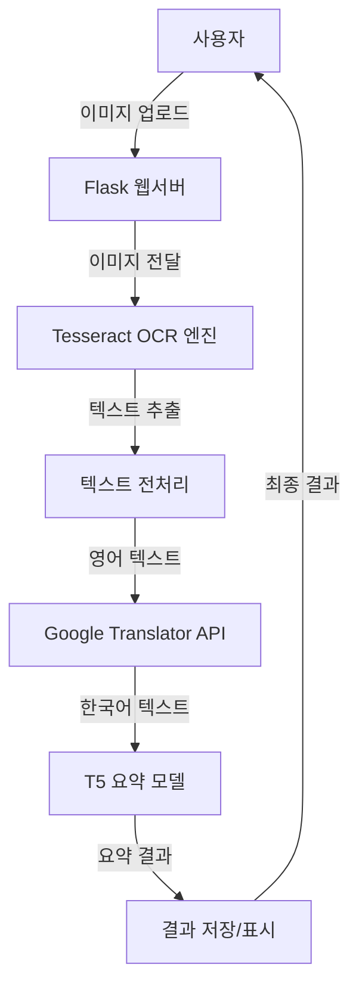

# 📝 OCR 번역 및 요약 웹 애플리케이션

## 📌 프로젝트 소개
이 프로젝트는 이미지에서 텍스트를 추출(OCR)하고, 영어를 한국어로 번역한 후 내용을 요약해주는 올인원 웹 애플리케이션입니다. Tesseract OCR, Google Translator, 그리고 T5 요약 모델을 통합하여 사용자에게 편리한 텍스트 처리 서비스를 제공합니다.

## 🎯 주요 기능
- **OCR (광학 문자 인식)**
  - 이미지에서 텍스트 추출
  - 다양한 이미지 형식 지원
  - Tesseract 엔진 활용

- **자동 번역**
  - 영어 → 한국어 번역
  - Google Translator API 활용
  - 실시간 번역 처리

- **텍스트 요약**
  - T5 모델을 활용한 한국어 텍스트 요약
  - 핵심 내용 추출
  - 사용자 지정 요약 길이

- **단어장 기능**
  - 번역된 단어/문장 자동 저장
  - 개인화된 단어장 제공
  - 학습 기록 관리

## 🛠 기술 스택
- **Backend**: 
  - Python
  - Flask
  - Tesseract OCR
  - Deep Translator
  - Hugging Face Transformers (T5)

- **Frontend**: 
  - HTML
  - CSS
  - JavaScript

- **AI/ML**:
  - T5 요약 모델
  - Tesseract OCR 엔진
  - Google Translator API

## 🔍 시스템 아키텍처
### 전체 시스템 구조


### 컴포넌트 상세 설명
1. **웹 서버 (Flask)**
   - 사용자 인터페이스 제공
   - 파일 업로드 처리
   - 세션 관리
   - 결과 표시

2. **OCR 처리 (Tesseract)**
   - 이미지 전처리
   - 텍스트 영역 감지
   - 문자 인식
   - 텍스트 추출

3. **번역 시스템 (Google Translator)**
   - 영어 → 한국어 번역
   - 에러 처리
   - 재시도 로직

4. **요약 엔진 (T5 Model)**
   - 텍스트 토큰화
   - 컨텍스트 분석
   - 핵심 내용 추출
   - 요약문 생성

## ⚙️ 설치 방법

1. 저장소 클론
```bash
git clone [저장소 URL]
```

2. 가상환경 생성 및 활성화
```bash
python -m venv venv
.\venv\Scripts\activate  # Windows
```

3. 필요한 패키지 설치
```bash
pip install -r requirements.txt
```

4. Tesseract OCR 설치
- Windows: [Tesseract 설치 프로그램](https://github.com/UB-Mannheim/tesseract/wiki) 다운로드 및 환경 변수 설정

5. T5 모델 준비
```python
# Google Colab에서 실행
from transformers import AutoTokenizer, AutoModelForSeq2SeqLM

# 모델과 토크나이저 로드
tokenizer = AutoTokenizer.from_pretrained("eenzeenee/t5-base-korean-summarization")
model = AutoModelForSeq2SeqLM.from_pretrained("eenzeenee/t5-base-korean-summarization")

# 모델과 토크나이저 저장
model_save_path = "./t5_korean_summarization_model"
model.save_pretrained(model_save_path)
tokenizer.save_pretrained(model_save_path)

# 압축 파일 생성 및 다운로드
import shutil
from google.colab import files
shutil.make_archive('t5_korean_summarization_model', 'zip', model_save_path)
files.download('t5_korean_summarization_model.zip')
```
- 다운로드 받은 `t5_korean_summarization_model.zip` 파일을 프로젝트 폴더에 압축 해제

6. 애플리케이션 실행
```bash
python app.py
```

## 📁 프로젝트 구조
```
ocr_translation_app/
│
├── app.py              # Flask 애플리케이션 메인
├── tesseract.py       # OCR 및 요약 처리
├── translate.py       # 번역 및 단어장 기능
│
├── templates/         # HTML 템플릿
│   └── index.html    # 메인 페이지
│
├── static/           # 정적 파일
│   ├── css/         # 스타일시트
│   └── js/          # JavaScript 파일
│
└── uploads/         # 업로드된 이미지 저장
```

## 💻 사용 방법
1. 웹 브라우저에서 `http://localhost:5000` 접속
2. 이미지 파일 업로드
3. OCR 처리 및 번역 대기
4. 번역된 텍스트와 요약문 확인
5. 단어장에서 번역 기록 확인

## 🌟 주요 구현 사항
1. **이미지 처리 및 OCR**
   - 다양한 이미지 형식 지원
   - 텍스트 추출 최적화
   - 정확도 향상을 위한 전처리

2. **번역 시스템**
   - 실시간 번역 처리
   - 에러 처리 및 재시도 로직
   - 번역 품질 최적화

3. **요약 기능**
   - T5 모델 기반 텍스트 요약
   - 컨텍스트 유지 알고리즘
   - 요약 길이 최적화

4. **사용자 인터페이스**
   - 직관적인 UI/UX
   - 실시간 처리 상태 표시
   - 반응형 디자인

## 🔧 개발 환경
- Python 3.8+
- Flask 2.0+
- Tesseract OCR 4.0+
- Windows/Linux/MacOS

## 🎉 프로젝트 특징
- 올인원 텍스트 처리 솔루션
- 사용자 친화적 인터페이스
- 확장 가능한 아키텍처
- 실시간 처리 지원
- 개인화된 학습 도구

## ⚠️ 참고사항
- 요약 모델 출처: [eenzeenee/t5-base-korean-summarization](https://huggingface.co/eenzeenee/t5-base-korean-summarization)
- 이 모델은 한국어 논문, 도서, 레포트 등의 요약을 위해 학습되었습니다.
- 인터넷 연결이 필요합니다 (번역 기능)

# 영어 텍스트 한국어 요약 프로그램

이 프로그램은 영어 텍스트를 인식하고 한국어로 번역한 후 요약하는 기능을 제공합니다.

## 설치 방법

1. Python 패키지 설치:
```bash
pip install -r requirements.txt
```

2. Tesseract OCR 설치:
- Windows에서 Tesseract OCR을 설치하고 환경 변수를 설정해야 합니다.

## 한국어 요약 모델 설정

이 프로젝트는 [eenzeenee/t5-base-korean-summarization](https://huggingface.co/eenzeenee/t5-base-korean-summarization) 모델을 사용합니다.

모델 파일은 다음과 같이 준비합니다:

1. Google Colab에서 다음 코드를 실행하여 모델을 다운로드:
```python
from transformers import AutoTokenizer, AutoModelForSeq2SeqLM

# 모델과 토크나이저 로드
tokenizer = AutoTokenizer.from_pretrained("eenzeenee/t5-base-korean-summarization")
model = AutoModelForSeq2SeqLM.from_pretrained("eenzeenee/t5-base-korean-summarization")

# 모델과 토크나이저 저장
model_save_path = "./t5_korean_summarization_model"
model.save_pretrained(model_save_path)
tokenizer.save_pretrained(model_save_path)

# 압축 파일 생성 및 다운로드
import shutil
from google.colab import files
shutil.make_archive('t5_korean_summarization_model', 'zip', model_save_path)
files.download('t5_korean_summarization_model.zip')
```

2. 다운로드 받은 `t5_korean_summarization_model.zip` 파일을 프로젝트 폴더에 압축 해제합니다.
3. 압축 해제한 `t5_korean_summarization_model` 폴더가 프로젝트 루트 디렉토리에 위치하는지 확인합니다.

## 실행 방법

```bash
python app.py
```

웹 브라우저에서 `http://localhost:5000`으로 접속하여 서비스를 이용할 수 있습니다.

## 주요 기능

1. 이미지에서 영어 텍스트 추출 (OCR)
2. 추출된 텍스트 한국어로 번역
3. 번역된 텍스트 요약

## 참고 사항

- 요약 모델 출처: [eenzeenee/t5-base-korean-summarization](https://huggingface.co/eenzeenee/t5-base-korean-summarization)
- 이 모델은 한국어 논문, 도서, 레포트 등의 요약을 위해 학습되었습니다. 